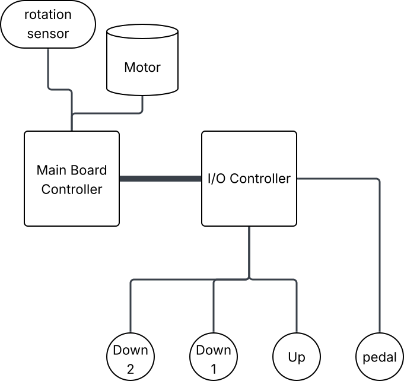

# Benchtop Planer Controller

A benchtop planer is a machine in a woodshop that is used to decrease the thickness
of wood slightly. A piece of wood is passed through the machine to remove thickness
from the wood, such as a small fraction of an inch. The planer is adjusted to lower
the blades, and the wood is passed through the machine to remove more material.

The planer is adjusted manually. This involves rotating a knob on the machine to set
it to the desired position. Between passing the wood plank through the machine, the
depth of the planer must be manually adjusted. Frequently, this involves decreasing
it by a fraction of an inch each time as the thickness of the plank is slowly reduced.

The goal of this project is to automate the _movement_ of the depth adjustment of
the planer. To simplify the process, the goal is to adjust the planer by moving it
up or down by a set amount, such as a quarter turn. While adjusting it by a specific
amount is possible, the goal is to help move it up and down by a set amount, not
necessarily to move it to a specific depth.

There are always more crazy things that can be done, but my goal is to simplify the
basic operation of the machine. Everything should work independently, so I don't
want to connect it to an app that might get outdated after several new versions of
Android. I want the system to be reactive. I don't want to wait for several seconds
to do something. This rules out using phones entirely, because it is my experience
that unlocking a phone and launching an app often takes over 10 seconds, which is
too long. The point is, it should do what it is supposed to do and do it very well,
without adding unnecessary complexity.

